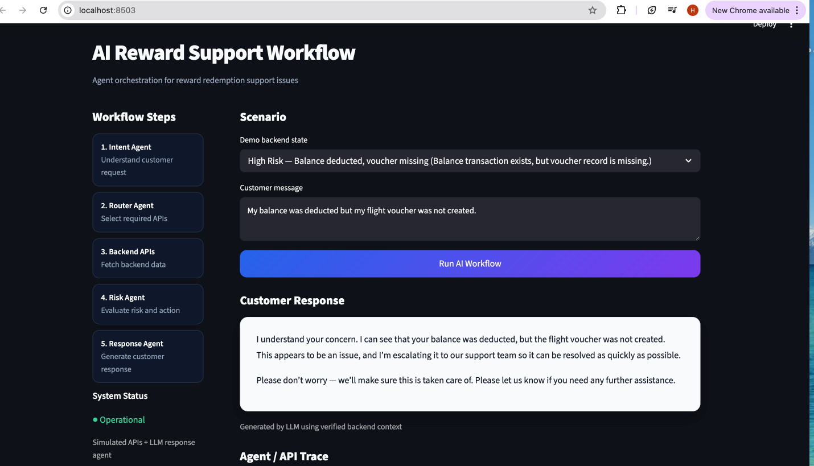
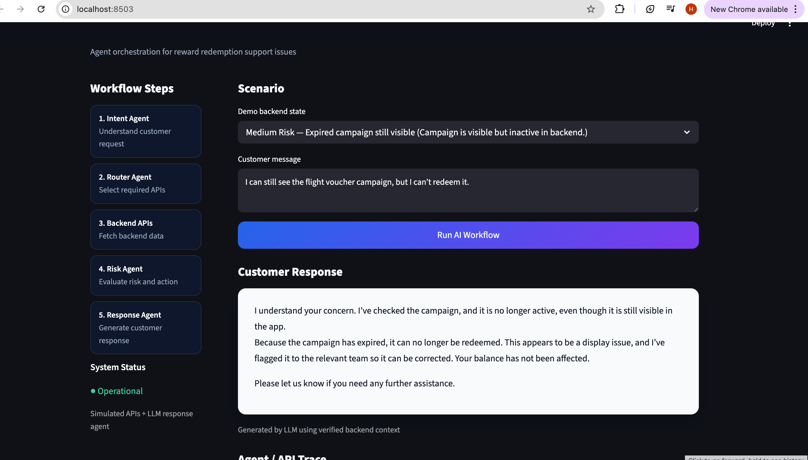

# AI Reward Support Workflow

## 🎥 Demo Video

A short walkthrough of the system and design decisions:

👉 [Watch the demo](https://www.loom.com/share/cb02fce687f94a7197533947cb525518)

The video demonstrates the workflow, decision logic, and system behavior across different risk scenarios.

## UI Preview





---

## Overview

This project demonstrates how an AI-driven system can improve a real-world customer support workflow in a reward redemption environment.

Rather than acting as a simple chatbot, the system is designed to understand context, retrieve real data, make decisions, and respond appropriately — while maintaining control through business rules.

---

## Problem Overview

Customer support teams frequently handle repetitive and time-sensitive issues such as:

- Missing vouchers after balance deduction  
- Campaigns that appear active but are not redeemable  
- Users unable to locate rewards  

These cases require:
- Understanding user intent  
- Validating backend data  
- Making accurate decisions  
- Providing clear responses  

This project focuses on automating these workflows while maintaining reliability and control.

---

## System Design

The system is structured as a modular decision-making workflow composed of multiple agents:

1. **Intent Agent**  
   Understands and identifies user intent from unstructured input

2. **Router Agent**  
   Determines which backend systems or APIs should be called  

3. **Data Layer (Backend APIs)**  
   Retrieves real-time structured data such as:
   - Balance transactions  
   - Voucher records  
   - Campaign status  

4. **Risk Agent**  
   Evaluates the risk level of the case based on data consistency and business rules  

5. **Response Agent**  
   Generates a clear, user-facing response based on the decision outcome  

This flow ensures that reasoning is grounded in data rather than purely language generation.

---

## Data Handling

The system combines:

- **Unstructured data** → customer messages  
- **Structured data** → backend system records  

All decision-making logic is based on structured backend data.

This improves reliability and ensures decisions are based on real data.

---

## Decision Logic

Decision-making is rule-driven and separated from the LLM.

Risk classification determines system behavior:

- **Low Risk** → Fully automated response  
- **Medium Risk** → Automated response + flagged for review  
- **High Risk** → Escalation to human support  

This enables a balance between automation and safety.

---

## Human-in-the-Loop Design

Human intervention is limited to high-risk scenarios.

This approach:
- Reduces operational load  
- Maintains safety in sensitive cases  
- Improves overall efficiency  

---

## Role of the LLM

The LLM is used strictly for response generation.

It does not:
- Make decisions  
- Execute business logic  
- Access backend systems directly  

All critical decisions are handled by rules and structured data.

---

## System Architecture (Production Vision)

In a production environment, this system would follow a modular architecture:

- An orchestration layer manages workflow execution  
- Backend services are accessed via APIs  
- Each agent operates as an independent component  

### Example integrations:
- Reward platforms  
- Voucher services  
- Campaign engines  
- CRM systems  

### Responsibilities of the orchestration layer:
- API coordination  
- Data validation  
- Error handling  
- Logging and monitoring  

This architecture ensures scalability, maintainability, and reliability.

---

## Tech Stack

- Backend: Python  
- UI: Streamlit  
- LLM: OpenAI API (response generation)  
- Data: Mock backend APIs  

---

## Business Impact

This system delivers measurable value:

- Reduces support workload through automation  
- Improves response time  
- Lowers operational costs  
- Allows teams to focus on complex, high-value cases  

---

## Running the Application

```bash
pip install -r requirements.txt
streamlit run app/main.py
```

---

## Environment Setup

Create a `.env` file in the root directory:

```env
OPENAI_API_KEY=your_api_key_here
```

Ensure this file is excluded from version control.

---

## Future Improvements

- Feedback loop for continuous improvement  
- Monitoring and alerting system  
- Integration with real-time data pipelines  
- Advanced risk modeling  

---

## Summary

This project demonstrates how AI systems can move beyond chat interfaces and operate as structured decision-making workflows — combining language understanding, data, and business logic.

The result is a system that is both automated and controlled, making it suitable for real-world applications.

---

## 🤖 AI-Driven Testing Layer

This project includes an AI-assisted testing workflow using Playwright and agent-based orchestration.

### Workflow

1. **Planner Agent**
   - Explores the UI
   - Generates a semantic test plan

2. **Generator Agent**
   - Converts the test plan into Playwright tests
   - Uses stable selectors and semantic assertions

3. **Healer Agent**
   - Fixes failing tests (single-pass repair)
   - Adjusts selectors and timing issues

### Key Principles

- Semantic validation (not exact LLM text matching)
- Streamlit-aware selectors
- Risk-based scenario coverage
- End-to-end workflow validation


### Test Execution

```bash
npx playwright test tests/generated/reward-support.spec.ts --headed
```


## 🏭 Production Considerations

This project is a demo system. In a real production environment, the following would be added:

### Reliability
- Retry logic for API failures
- Timeout and fallback handling
- Circuit breaker patterns

### Observability
- Structured logging
- Request tracing across agents
- Metrics and monitoring (latency, failures)

### Human-in-the-loop
- High-risk cases require manual approval
- Escalation workflows
- Audit trail of decisions

### Data & Integration
- Replace mock JSON with real backend APIs
- Database integration for tickets and history
- Authentication & authorization

### Agent Orchestration
- Move from rule-based routing to hybrid LLM + rules
- Introduce state management across agents
- Add memory/context persistence

---

## 🚀 What This Demonstrates

- AI-assisted system design
- Multi-agent workflow orchestration
- End-to-end test automation with Playwright
- Semantic validation of AI outputs
- Practical approach to building testable AI systems