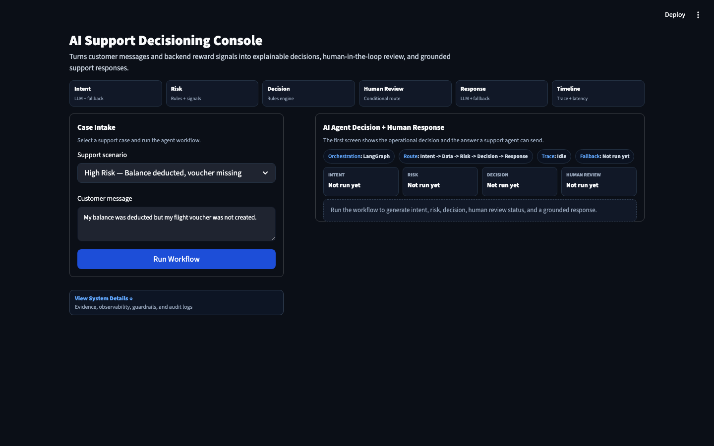
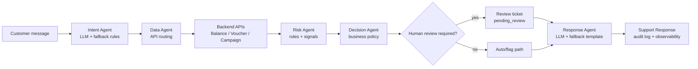

# AI Support Decisioning System

Production-style AI workflow for customer support triage in a reward redemption business.

This project is designed as an AI Engineer / Prompt Engineer case study: it shows how to combine LLMs, deterministic business rules, backend data, human review, observability, and evals into a workflow that could plausibly move from prototype toward production.

## What It Does



## Demo Video

[Watch the 4-minute Loom walkthrough](https://www.loom.com/share/abdc7793d91243618d9bf5117a799bc6)

The app handles common reward support cases:

- customer balance was deducted but no flight voucher was created
- an expired campaign is still visible and confusing customers
- a voucher exists but the customer cannot find it

Instead of letting the LLM make unsupported decisions, the system separates responsibilities:

| Layer | Owner | Production purpose |
| --- | --- | --- |
| Intent | LLM + fallback rules | Understand the customer message |
| Data | Backend APIs | Retrieve grounded facts |
| Risk | Rules + signals | Detect safety, policy, and data consistency risk |
| Decision | Rules engine | Select the business action |
| Response | LLM + fallback templates | Draft a clear customer-facing answer |
| Human Review | Conditional LangGraph node | Keep sensitive or inconsistent cases in the loop |

The main console is intentionally designed as a decisioning UI, not a chatbot screen. The first view shows the case intake, operational decision summary, decision rationale, backend data signals, a **Support Response** section, and a readable human review ticket bar such as `Review Ticket: REV-XXXX -> View Details`.

Detailed technical evidence stays available below the main workflow through collapsed **System Details** sections for evidence, observability, guardrails, and sanitized audit logs.

## Why This Is Not Just A Chatbot

The LLM is used where language helps: intent interpretation and response writing. The LLM does not own policy, issue refunds, mutate records, or decide whether a customer gets compensation.

Business-critical decisions are made from structured backend data and explicit rules. Every run produces a trace ID, risk signals, called APIs, response mode, fallback status, and audit log.

## Architecture



## Workflow State

The workflow passes a typed state object across agents:

- `trace_id`
- `customer_message`
- `intent`, `intent_confidence`, `intent_mode`
- `required_apis`
- `backend_data`
- `risk_level`, `risk_signals`
- `decision`, `decision_reason`
- `requires_human_review`, `human_review_reason`, `review_ticket`
- `response`, `response_mode`
- `fallback_used`, `errors`, `audit_log`

This makes the workflow inspectable, testable, and debuggable.

## Production Behaviors Included

- **Fallbacks:** the app runs without an OpenAI key using deterministic rules and templates.
- **LLM guardrails:** intent classification validates JSON, clamps confidence, and rejects low-confidence outputs.
- **Grounding:** response generation can only use workflow state and backend facts.
- **Human-in-the-loop:** high-risk cases route through a dedicated `human_review_agent` node and create a simulated review ticket.
- **Observability:** trace ID, step latency, fallback mode, errors, and audit events are visible.
- **Eval:** deterministic scenario eval validates intent, risk, and decision accuracy.
- **Testing strategy:** planner/generator/healer agent contracts define how AI-assisted tests should be created and repaired without weakening business assertions.
- **PII redaction:** customer messages are redacted before LLM-facing state is used.
- **CI:** Python compile, unit/integration tests, eval, and Playwright E2E are defined in GitHub Actions.

## Technical Decisions

- **LangGraph over a simple function chain:** the workflow is stateful and now includes conditional routing into human review.
- **Deterministic policy outside the LLM:** the LLM does not decide escalation, refunds, or account actions.
- **POM-style E2E tests:** Playwright tests use a page object in `tests/e2e/pages` to keep UI automation maintainable.
- **Semantic assertions over brittle prose checks:** tests validate stable business facts instead of exact LLM wording.
- **Fallback-first reliability:** the app remains usable when the LLM key is missing or model calls fail.
- **Auditability as a product feature:** trace ID, risk signals, modes, review tickets, and audit logs are visible in the UI.
- **Production UI language:** customer drafts are labeled **Support Response**, review tickets use readable labels, and backend details are discoverable without cluttering the main decision panel.

## Scenarios

| Scenario | Expected intent | Expected risk | Expected decision | Human review |
| --- | --- | --- | --- | --- |
| Balance deducted, voucher missing | `reward_issue` | `high` | `escalate_to_human` | required |
| Expired campaign still visible | `campaign_issue` | `medium` | `flag_for_review` | not required |
| Voucher already issued | `reward_issue` | `low` | `auto_respond` | not required |

## Decision Policy Table

The LLM does not own this table. It is deterministic business logic.

| Intent | Backend / risk signal | Risk | Decision | Human review | Why |
| --- | --- | --- | --- | --- | --- |
| `reward_issue` | `balance_deducted` + `voucher_missing` | `high` | `escalate_to_human` | yes | Financial inconsistency must be verified before resolution |
| `reward_issue` | `voucher_found` | `low` | `auto_respond` | no | The voucher exists and the customer only needs location guidance |
| `campaign_issue` | `campaign_visible` + `campaign_inactive` | `medium` | `flag_for_review` | no | The customer can be informed while ops reviews campaign display |
| `balance_issue` | completed balance transaction | `medium` | `flag_for_review` | no | Transaction should be verified but does not always require escalation |
| `refund_request` | refund or policy exception requested | `high` | `escalate_to_human` | yes | Refund decisions require human approval |
| unknown / backend unavailable | missing or unvalidated backend facts | `high` | `escalate_to_human` | yes | The system fails safe when facts cannot be validated |

## Code Structure

```text
app/
  main.py                         Streamlit support triage UI
  styles/                         UI styling

src/reward_support/
  agents/                         Intent, data, risk, decision, response agents
  application/                    UI-facing workflow service
  config/                         Demo scenarios
  integrations/                   Simulated backend APIs
  orchestration/                  LangGraph workflow and shared state
  services/                       Supporting services

evals/
  eval_dataset.json               Deterministic scenario dataset
  run_eval.py                     Non-UI workflow eval
  run_langgraph_eval.py           LangGraph smoke eval

tests/ai_testing_agents/
  planner_agent.md                Test planning contract
  test_generator_agent.md         Playwright generation contract
  test_healer_agent.md            Test healing contract

tests/unit/
  test_agents.py                  Agent-level unit tests

tests/integration/
  test_workflow_service.py        Workflow service integration tests

tests/e2e/
  pages/supportTriagePage.ts      Playwright Page Object Model
  reward-support.spec.ts          End-to-end workflow scenarios

docs/
  case-study.md                   Portfolio case study narrative
  prompting.md                    Prompt contracts and guardrails
  playwright-agent-prompts.md     Major prompts for quota-aware Playwright agent use

prompts/
  intent_classifier_v1.md         Versioned intent prompt
  response_agent_v1.md            Versioned response prompt
```

## Run The App

```bash
pip install -r requirements.txt
streamlit run app/main.py
```

Optional `.env`:

```env
OPENAI_API_KEY=your_api_key_here
OPENAI_MODEL=gpt-4.1-mini
```

If no API key is available, the system uses deterministic fallbacks.

## Run Eval

```bash
venv/bin/python evals/run_eval.py
```

Current fallback-mode result:

```text
Intent Accuracy: 1.00
Risk Accuracy: 1.00
Decision Accuracy: 1.00
```

## Run Python Tests

```bash
OPENAI_API_KEY= SUPPORT_TICKET_PATH=/private/tmp/reward_support_test_tickets.json \
venv/bin/python -m unittest discover -s tests -p 'test_*.py'
```

## Run E2E Tests

```bash
npm run test:e2e
```

For a headed browser run:

```bash
npm run test:e2e:headed
```

## Business Impact

In a real support operation, this system would make triage faster, cheaper, and more consistent:

- low-risk voucher status cases can be answered automatically
- medium-risk campaign issues can be flagged with evidence for ops teams
- high-risk financial inconsistencies are escalated with a review ticket
- support agents get a grounded **Support Response** instead of writing from scratch
- managers get auditability around why each decision was made

The adoption path is practical because the system does not require replacing human agents. It reduces repetitive investigation work while keeping policy-sensitive cases in human review.

## Production Roadmap

To move this from portfolio demo to production:

- replace mock APIs with authenticated reward, voucher, campaign, and CRM services
- persist workflow runs, tickets, audit logs, and response versions
- add role-based access control and customer data protection
- add retries, timeouts, circuit breakers, and idempotency keys
- add offline eval sets from historical tickets
- add online quality monitoring for fallback rate, escalation rate, latency, and agent edits
- add prompt/version tracking and approval workflow
- add PII redaction before model calls
- add human feedback loop for continuous prompt and policy improvement

## Related Docs

- [Case study](docs/case-study.md)
- [Prompting and guardrails](docs/prompting.md)
- [Major Playwright agent prompts](docs/playwright-agent-prompts.md)
